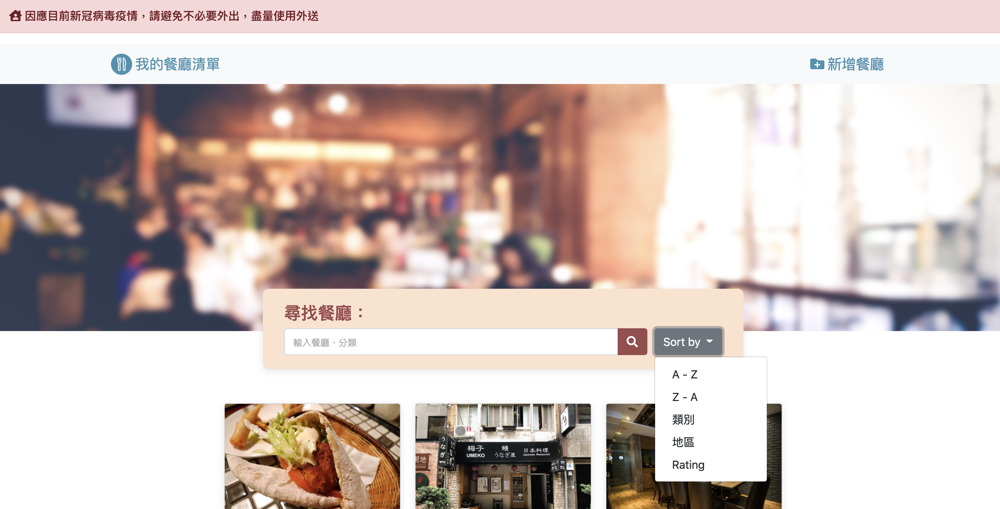

# My Restaurant list

my restaurant list is a website which provide restaurant detail. This website is built based on Node.js and Express

## Feature

- Show a list of restaurant at landing page
- Use search bar to filter restaurant
- Click on each restaurant card will show more detail and a short description. If there is no match result, will display error message
- Banner shows the COVID-19 message
- Edit existing restaurant record
- Delete existing restaurant record
- Add new restaurant
- Sory by name A-Z, name Z-A, catrogry, rating, location

## Getting Started

Clone repository

    git clone https://github.com/heidichen90/my-restaurant-list.git

Install Dependancies

    npm install

Spin up server

if you have nodemon

    npm run dev

if you dont have nodemon

    npm run start

The website should start running on

    http://localhost:3000/

Load up seed data

    npm run seed

## Built With

- [Node.js](https://nodejs.org/en/) (v10.15.0)
- [Express](https://expressjs.com/) (v4.17.1)
- [Express-Handlebars](https://www.npmjs.com/package/express-handlebars) (v5.3.2)
- [Bootstrap](https://getbootstrap.com/) (v4.3.1)
- [Mongoose ODM](https://mongoosejs.com/) (v5.12.13)
- [Mongodb](https://www.mongodb.com/) (v4.2.14)
- [method-override](https://www.npmjs.com/package/method-override) (v3.0.0)

## Author

Heidi Chen
